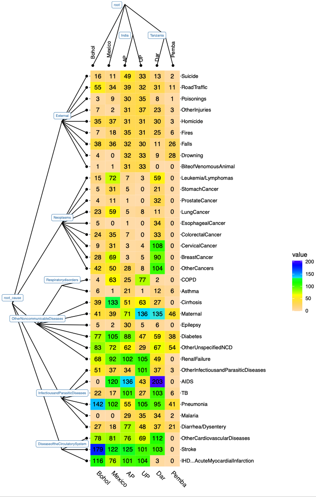

**doubletree**: 

An R package for Empowering Domain-Adaptive Probabilistic Cause-of-Death Assignment using Verbal Autopsy via Double-Tree Shrinkage

**Maintainer**: Zhenke Wu, zhenkewu@umich.edu


**References**: If you are using **doubletree** for tree-informed Bayesian domain
adaptation, please cite the following preprint:

|       | Citation     | Paper Link
| -------------  | -------------  | -------------  |
|  1.   | Wu Z, Li RZ, Chen I, Li M + (2021+). Tree-informed Bayesian Domain Adaptation. Working Paper.   |[Link]()| 


## Table of content
- [1. Installation](#id-section1)
- [2. Overview](#id-section2)
- [3. Examples](#id-section3)

<div id='id-section1'/>

Installation
--------------
```r
# install bioconductor package `ggtree` for visualizing results:
if (!requireNamespace("BiocManager", quietly = TRUE))
    install.packages("BiocManager")

BiocManager::install("ggtree")

install.packages("devtools",repos="https://cloud.r-project.org")
devtools::install_github("zhenkewu/doubletree")
```


<div id='id-section2'/>

Overview
----------
Ascertaining the causes of deaths absent vital registries presents a major barrier to under-standing  cause-specific  burdens  of  mortality  and  public  health  management.   Verbal  autopsy(VA) surveys are increasingly adopted in these resource poor settings.  Relatives of a deceased person are interviewed about symptoms leading up to the death.  Statistical methods have beendevised for estimating the cause-specific mortality fractions (CSMF). However, expansion of VA from established to new sites has raised acute needs of domain-adaptive and accurate CSMF estimation methods that can handle imbalanced and sparse death counts in many cause-domain combinations.  In this paper, we propose a method that starts with a hierarchy for the domains and adaptively learns the between-domain similarity in the conditional distribution of the survey responses given a cause.  In addition,  the method uses a second pre-specified cause hierarchy to borrow information across cause groups so that each group has similar conditional response probabilities.  Through simulation studies, the method, referred to as “double-tree shrinkage”,is shown to improve the precision and reduce the asymptotic bias in estimating CSMFs as a result of the flexible and adaptive conditional dependence structure estimation.  We also evaluate and illustrate the method using PHMRC VA data.  The paper concludes with a discussion on limitations,  extensions and highlights the central role of domain adaptivity offered by the proposed method in ongoing VA survey research.


The `doubletree` package works with the following scenarios:

* Scenario a: No missing leaf labels in tree1 or tree2, for all observations; So this is reduced to a nested latent class model estimation prorblem with parameter shrinkage according to the two trees.

* Scenario b: All missing tree1 leaf label occurred for in a single leaf node in tree2 (say v2):
    1. Scenario b1: No observation with observed tree1 label in leaf v2;
    2. Scenario b2: More than 1 observations have observed tree1 label in leaf v2.

* Scenario c: Missing tree1 leaf labels occurred for observations in 2 or more leaf nodes in tree2, say the leaf node set S:
    1. Sub-scenarios: 0,1,2,... leaf/leaves in S have partially observed leaf label in tree1


<div id='id-section3'/>

Examples 
---------

* main function `nlcm_doubletree`

* A simple workflow using simulated data and two trees obtained from [PHMRC data](http://ghdx.healthdata.org/record/ihme-data/population-health-metrics-research-consortium-gold-standard-verbal-autopsy-data-2005-2011); also check out the `openVA` package that processed the raw data into binary indicators: [openVA](https://github.com/verbal-autopsy-software/openVA).
    1. in`R`, check the example by `example(nlcm_doubletree)`; note that this example uses the hierarchies, but simulates data based on a set of true parameters and sample sizes.
    2. the hierarchy for 35 causes and the hierarchy for 6 domains is shown below. The numbers in the cells indicate the number of physician-coded cause-of-death (COD) in a particular site ("domain"). In the most common situation this package is designed for, we would not observe the membership of some deaths to the cells. For example, in `AP` site, we may not be able to see the tabulation by the CODs (by row), but just a total number of deaths in `AP` (the column sum for AP in the table shown here). `doubletree` will provide an estimate of 
        * the population cause-specific mortality fraction in `AP` (a vector of length 35 that sums to 1);
        * individual-specific posterior probability of CODs (a vector of length 35 that sums to 1), based on which we may obtain, e.g., _maximum a posteriori_ COD for each death given the survey responses.
    
    . 
    
